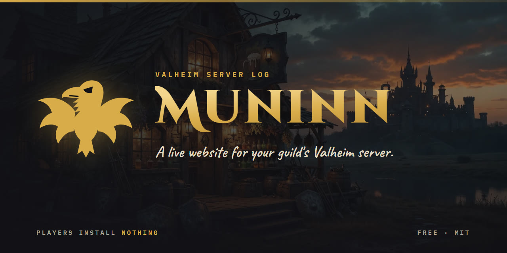
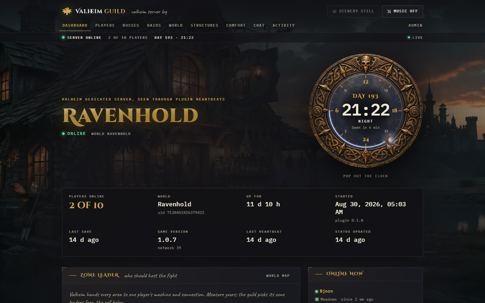
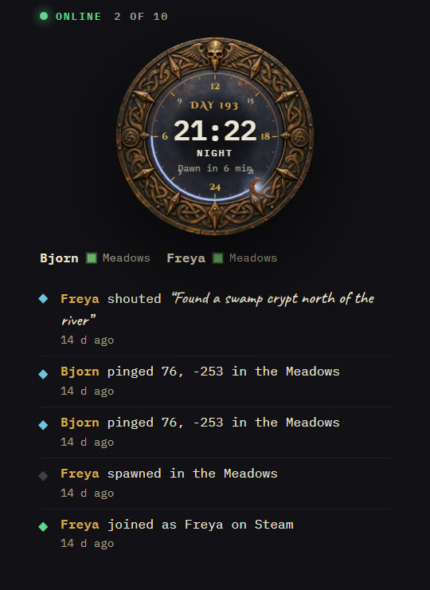
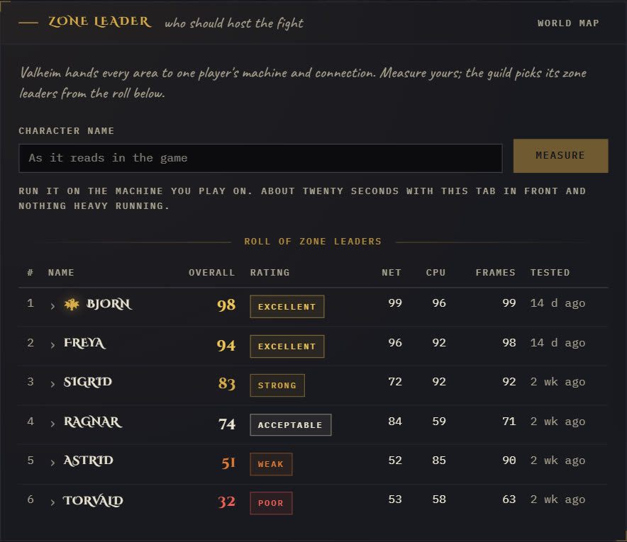
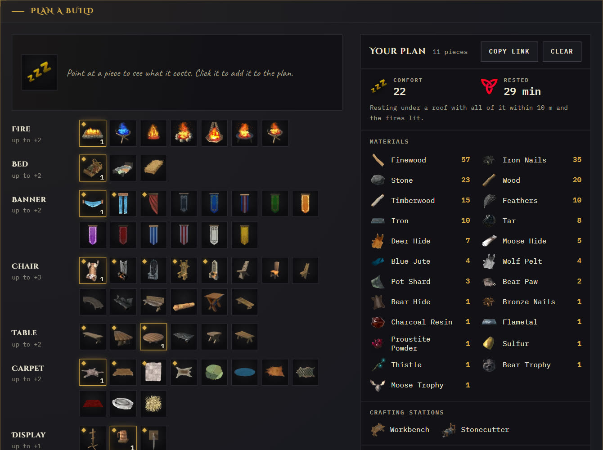

  

  <a href="https://oddessentials.github.io/muninn/"><b>Website</b></a> &nbsp;·&nbsp;
  <a href="https://thunderstore.io/c/valheim/p/oddessentials/Muninn/"><b>Thunderstore</b></a> &nbsp;·&nbsp;
  <a href="https://github.com/oddessentials/muninn/pkgs/container/muninn"><b>Docker image</b></a> &nbsp;·&nbsp;
  <a href="LICENSE"><b>MIT licence</b></a>

Muninn gives your Valheim guild its own website. A plugin on the dedicated server reports what happens in the world, and the site shows it live. Players install nothing.

  

## Only in Muninn

<table>
  <tr>
    <td width="34%" valign="top">
      
      <h3>World clock</h3>
      The in-game day and hour on a bronze dial, live from the server. Pop it out into its own window. The activity feed warns the guild before nightfall.
    </td>
    <td width="66%" valign="top">
      
      <h3>Zone leader</h3>
      Valheim hands every area to one player's machine. Each player measures theirs in the browser in about twenty seconds, and the guild sees who should host the fight.
    </td>
  </tr>
</table>

### Comfort planner

Every comfort piece, read from the game your server runs, with its icon and recipe. Pick pieces and the plan adds up comfort, Rested time and every material you need.

## Also on the site

- Who is online, where they are and for how long
- Boss progression, raids, deaths and kills
- Every structure built, the explored world map, the activity feed and chat
- An admin area for plugin setup, in-game announcements and backups
- Switches to hide chat, positions, the map or Steam ids

## Install

1. Deploy the site with the Railway button above, or with Docker Compose on your own machine: the [website](https://oddessentials.github.io/muninn/) has the file and the commands.
2. Open `/admin` on your site and set the password.
3. On the Plugin page, download the DLL and its config, put them in BepInEx on the game server, and restart it.

The plugin needs [BepInExPack_Valheim](https://thunderstore.io/c/valheim/p/denikson/BepInExPack_Valheim/) on the server. It sends only to the site in its config; the [Thunderstore page](https://thunderstore.io/c/valheim/p/oddessentials/Muninn/) lists everything it sends.

Muninn is a fan project, not affiliated with Iron Gate or Coffee Stain.
